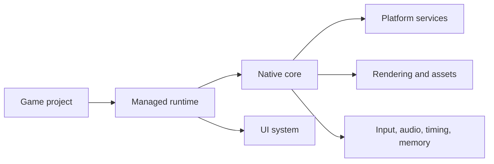

# AssemblyEngine

AssemblyEngine is a Windows game engine with a native core and a C# runtime for gameplay code, scenes, components, UI workflows, and a unified render surface. The current implementation targets Windows x64 and Windows ARM64, uses HTML/CSS files for HUD and overlay rendering, and can present the managed framebuffer through Vulkan when that backend is explicitly requested.

## Why AssemblyEngine

- **AI speaks Assembly in his native tongue** Let AI handle the low-level details of CPU registers, memory management, and platform APIs while you stay focused on expressive, high-level game design.
- Explore a readable low-level engine architecture without hiding the core behind a large native framework.
- Keep gameplay code approachable in C# while the renderer, platform layer, input, timing, audio, and memory live in NASM.
- Use simple HTML/CSS for in-game overlays instead of a separate browser process or a custom widget toolkit.
- Grow from a Windows x64 prototype into a multi-platform engine over time.

## Current Status

- Supported platforms: Windows x64, Windows ARM64
- Native core: NASM x64 backend, NativeAOT ARM64 backend, shared Win32 window/input/audio contract with software presentation fallback
- Managed runtime: .NET 10
- Rendering: unified managed 2D/3D color + depth surface, opt-in Vulkan swapchain presentation, native framebuffer upload fallback
- Multiplayer: managed direct peer-to-peer and localhost sessions over the runtime multiplayer service
- Sample games: Dash Harvest in `sample/basic`, Citadel Breach in `sample/fps`, Frontier Foundry in `sample/rts`, Lantern Letters in `sample/visual-novel`
- UI system: runtime HTML/CSS parsing with a built-in text renderer

## Project Overview



The game project uses the managed runtime, the runtime bridges to the native core for windowing and low-level services, and the runtime's unified renderer feeds either a Vulkan presenter or the native framebuffer fallback.

## What You Can Build Today

- Resizable 2D and lightweight 3D applications on Windows x64 and Windows ARM64 with windowed, maximized, and borderless fullscreen presentation modes
- Unified 2D and 3D rendering on the same managed color/depth surface
- Immediate-mode style drawing via pixel, line, rectangle, circle, mesh, and cube primitives
- BMP sprite loading and drawing through the same managed renderer used by 3D geometry
- WAV audio playback
- Scene-based games with entities, components, and scripts
- HTML/CSS HUD overlays updated from C# scripts
- Direct host or join multiplayer flows from managed scripts through `GameEngine.Multiplayer`
- Vulkan swapchain presentation when `GameEngine.PresentationBackend` is set to `GraphicsBackend.Vulkan`, with native software blitting as fallback

If Vulkan is explicitly requested but the runtime cannot load the required swapchain entry points from the active driver stack, AssemblyEngine logs a warning and continues on the unified software path instead of failing startup.

## Quick Start

1. Bootstrap the local toolchain:

```powershell
.\setup.ps1
```

The setup script installs any missing prerequisites that the solution and samples need, including:
- .NET 10 SDK
- Visual Studio Build Tools with the required C++ workloads and x64 or ARM64 linker components
- NASM for the x64 assembly backend
- On Windows ARM64, the x64 .NET runtime used by the win-x64 compatibility build

If you only want an audit, run:

```powershell
.\setup.ps1 -CheckOnly
```

2. Audit the local toolchain without changes:

```powershell
.\setup.ps1 -CheckOnly
```

3. Build the native core, runtime, and sample game:

```powershell
powershell -NoProfile -ExecutionPolicy Bypass -File .\shell\build.ps1
```

On Windows ARM64, `build.ps1` defaults to the native `arm64` backend. To build the compatibility x64 backend explicitly, run:

```powershell
powershell -NoProfile -ExecutionPolicy Bypass -File .\shell\build.ps1 -TargetArchitecture x64
```

To publish the visual novel sample instead of Dash Harvest, pass the sample selector:

```powershell
powershell -NoProfile -ExecutionPolicy Bypass -File .\shell\build.ps1 -Sample visual-novel
```

To publish the 3D FPS sample instead, run:

```powershell
powershell -NoProfile -ExecutionPolicy Bypass -File .\shell\build.ps1 -Sample fps
```

To publish the RTS sample instead, run:

```powershell
powershell -NoProfile -ExecutionPolicy Bypass -File .\shell\build.ps1 -Sample rts
```

To publish self-contained bundles for every sample into isolated folders, run:

```powershell
powershell -NoProfile -ExecutionPolicy Bypass -File .\shell\publish_samples.ps1 -TargetArchitecture x64
```

For Windows ARM64 sample bundles, run:

```powershell
powershell -NoProfile -ExecutionPolicy Bypass -File .\shell\publish_samples.ps1 -TargetArchitecture arm64
```

That command writes per-sample runnable outputs to `build/sample-publish/<architecture>` and marks them as sample binaries rather than source or engine SDK artifacts.

4. Run the sample:

```powershell
.\build\output\SampleGame.exe
```

Or, after using `-Sample visual-novel`:

```powershell
.\build\output\VisualNovelSample.exe
```

Or, after using `-Sample fps`:

```powershell
.\build\output\FpsSample.exe
```

Or, after using `-Sample rts`:

```powershell
.\build\output\RtsSample.exe
```

Dash Harvest controls:

- `WASD` or arrow keys move
- `Space` dashes
- `R` or `Enter` restarts after game over
- `F1` opens the display settings panel

Dash Harvest now also plays generated 8-bit SFX for dashes, pickups, hits, wave transitions, and game over.

Dash Harvest also includes a small 3D cube backdrop rendered through the same surface as its 2D gameplay and HUD, which makes it a useful sanity check for the unified renderer and Vulkan presenter.

To request Vulkan in the basic sample, set `presentationBackend` to `vulkan` in `sample/basic/sample-settings.json`.

Lantern Letters controls:

- `Space`, `Enter`, or `Right Arrow` advance dialogue
- `Tab` toggles skip mode
- Hold `Shift` or `Control` to fast reveal the current line
- `F5` saves and `F9` loads the current dialogue state
- `Home` restarts the scene

Lantern Letters also plays generated 8-bit UI and dialogue SFX for advancing text, skip toggles, save/load, restart, and chapter end.

Citadel Breach controls:

- `WASD` move
- Mouse or `Left` and `Right` arrows look
- Left mouse or `Space` fires
- Hold `Shift` to sprint
- `F1` toggles the control panel
- `R` or `Enter` restarts after mission clear or failure

Frontier Foundry controls:

- The sample now opens on a main menu with single-player, direct peer host/join, and localhost host/join options
- Click the callsign, IPv4, or port fields to edit them, then use the lobby to mark ready and start the mission
- Left drag selects units; hold Shift to add or Ctrl to remove
- Right click issues move or harvest orders
- Right click with no selection moves the HQ rally point
- Left click the minimap instantly recenters the camera
- Middle click snaps the camera to the cursor position
- `Q` queues a worker and `E` queues a guard
- `1`, `2`, and `3` select workers, guards, or all units, and `Space` focuses the current selection or HQ
- Arrow keys or moving the cursor to the screen edge pans the camera
- `F1` toggles the command brief and `R` or `Enter` restarts after victory or defeat

The sample persists display and lobby preferences in `sample-settings.json`. `Window mode`, `Resolution`, `VSync`, `UI scale`, `playerName`, `peerAddress`, and `multiplayerPort` all survive restarts, and maximize or restore events now resize the engine surface dynamically.

If you want to inspect or drive a running game from an AI agent, the repo also includes a stdio MCP server in `src/tools/AssemblyEngine.RuntimeMcpServer`. It can launch a game, tail structured runtime logs, return live runtime state, capture the current game framebuffer, and inject keyboard or mouse input. The checked-in `.vscode/mcp.json` file includes an `assemblyengine-runtime` server entry so current VS Code builds can auto-discover it from the workspace. See [Runtime MCP server](docs/runtime-mcp.md).

Typical runtime MCP workflow:

- Start the `assemblyengine-runtime` MCP server from the workspace or your MCP client.
- Call `launch_game` with `build/output/SampleGame.exe` or another AssemblyEngine game executable.
- Use `get_session_status` and `wait_for_logs` to inspect runtime state and tail logs.
- Use `capture_screenshot` to grab the current rendered frame and `send_key` or mouse tools to drive the game.

If you prefer to iterate from an IDE, building `sample/basic/SampleGame.csproj`, `sample/fps/FpsSample.csproj`, `sample/rts/RtsSample.csproj`, or `sample/visual-novel/VisualNovelSample.csproj` on Windows also triggers `shell/build_core.ps1` before the managed build. Choose the `ARM64` solution platform to build the native ARM64 backend.

## Minimal Example

The engine is designed so that a game project mainly needs a scene, a script, and an entry point.

```csharp
using AssemblyEngine.Core;
using AssemblyEngine.Engine;
using AssemblyEngine.Scripting;

namespace HelloAssemblyEngine;

public sealed class MainScene : Scene
{
	public MainScene() : base("Main") { }

	public override void OnLoad()
	{
		var player = CreateEntity("Player");
		player.Position = new Vector2(128, 128);

		var collider = player.AddComponent<BoxCollider>();
		collider.Width = 32;
		collider.Height = 32;
	}
}

public sealed class PlayerScript : GameScript
{
	public override void OnDraw()
	{
		var player = Scene.FindByName("Player");
		if (player is null)
			return;

		Graphics.DrawFilledRect(
			(int)player.Position.X,
			(int)player.Position.Y,
			32,
			32,
			new Color(110, 240, 255));
	}
}

public static class Program
{
	public static void Main()
	{
		var engine = new GameEngine(800, 600, "Hello AssemblyEngine");
		engine.Scenes.Register("main", new MainScene());
		engine.Scripts.RegisterScript(new PlayerScript());
		engine.Scenes.LoadScene("main");
		engine.Run();
	}
}
```

`GameEngine` owns the frame loop, `Scene` creates and manages entities, and `GameScript` handles per-frame behavior. Entities now expose both 2D helpers and 3D transform fields (`Position3D`, `Scale3D`, `Rotation3D`) so gameplay code can stay in one scene graph while using either draw style. The sample project in `sample/basic` shows a larger version of the same pattern with a HUD overlay, arcade loop, and a simple rotating 3D backdrop.

## Repository Layout

| Path | Purpose |
| --- | --- |
| `src/core` | Native engine core written in NASM |
| `src/nativearm64` | Native ARM64 backend built as a NativeAOT shared library |
| `src/runtime` | Managed runtime, interop layer, scene system, and UI stack |
| `sample/basic` | Playable 2D arcade sample built on top of the runtime |
| `sample/fps` | Playable 3D FPS arena sample built on top of the runtime |
| `sample/rts` | Playable top-down RTS sample with harvesting, production, and enemy raids |
| `sample/visual-novel` | Visual novel sample with dialogue, save/load, sprites, and parallax |
| `shell` | Build and setup scripts |
| `docs` | Project documentation and diagrams |
| `build/output` | Generated binaries and copied UI assets |

## Documentation

- [Getting started](docs/getting-started.md)
- [Architecture](docs/architecture.md)
- [Project goals](docs/project-goals.md)
- [Implementation guide](docs/implementation-guide.md)
- [Runtime MCP server](docs/runtime-mcp.md)
- [Contributing](CONTRIBUTING.md)

## Roadmap

Near-term priorities:

- Stabilize the Windows x64 runtime and native API surface
- Keep the Windows ARM64 backend aligned with the x64 native contract
- Expand the managed wrappers around the native exports
- Improve the asset and tooling story around sprites, audio, and UI
- Keep the architecture readable and easy to extend

Longer-term platform targets:

- Linux
- macOS
- iOS
- Android
- WebAssembly

## Contributing

Contributions are welcome, especially around native features, managed wrappers, sample content, documentation, and additional platform work. Start with [CONTRIBUTING.md](CONTRIBUTING.md) and the [implementation guide](docs/implementation-guide.md) so changes follow the existing layer boundaries.

## License

AssemblyEngine is licensed under the Apache License 2.0. See [LICENSE](LICENSE) and [NOTICE](NOTICE) for the license text and attribution.
