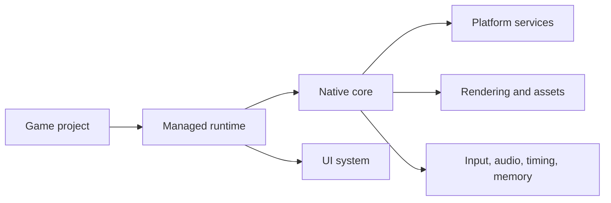

# AssemblyEngine

AssemblyEngine is a 2D game engine with a native core and a C# runtime for gameplay code, scenes, components, and UI workflows. The current implementation targets Windows x64 and Windows ARM64, and uses HTML/CSS files for HUD and overlay rendering.

## Why AssemblyEngine

- **Assembly is the language of AI**: Let the AI handle the gritty, low-level details of CPU registers, memory management, and platform APIs. It thrives in the exactness of the depths, freeing you to speak the expressive, high-level language of creative game design!
- Explore a readable low-level engine architecture without hiding the core behind a large native framework.
- Keep gameplay code approachable in C# while the renderer, platform layer, input, timing, audio, and memory live in NASM.
- Use simple HTML/CSS for in-game overlays instead of a separate browser process or a custom widget toolkit.
- Grow from a Windows x64 prototype into a multi-platform engine over time.

## Current Status

- Supported platforms: Windows x64, Windows ARM64
- Native core: NASM x64 backend, NativeAOT ARM64 backend, shared Win32/software-renderer contract
- Managed runtime: .NET 10
- Sample game: Dash Harvest in `sample/basic`
- UI system: runtime HTML/CSS parsing with a built-in text renderer

## Project Overview



The game project uses the managed runtime, the runtime bridges to the native core, and the native core owns the low-level platform and rendering services.

## What You Can Build Today

- Resizable 2D applications on Windows x64 and Windows ARM64 with windowed, maximized, and borderless fullscreen presentation modes
- Immediate-mode style drawing via pixel, line, rectangle, and circle primitives
- BMP sprite loading and drawing
- WAV audio playback
- Scene-based games with entities, components, and scripts
- HTML/CSS HUD overlays updated from C# scripts

## Quick Start

1. Install the prerequisites:
   - .NET 10 SDK and runtime
   - Visual Studio 2026 or Build Tools with the Desktop development with C++ workload
	- NASM if you want to build the x64 assembly backend
	- On Windows ARM64, install the x64 .NET runtime or SDK as well if you also want to run the win-x64 compatibility build
2. Validate your local toolchain:

```powershell
.\setup.ps1
```

3. Build the native core, runtime, and sample game:

```powershell
powershell -NoProfile -ExecutionPolicy Bypass -File .\shell\build.ps1
```

On Windows ARM64, `build.ps1` defaults to the native `arm64` backend. To build the compatibility x64 backend explicitly, run:

```powershell
powershell -NoProfile -ExecutionPolicy Bypass -File .\shell\build.ps1 -TargetArchitecture x64
```

4. Run the sample:

```powershell
.\build\output\SampleGame.exe
```

Dash Harvest controls:

- `WASD` or arrow keys move
- `Space` dashes
- `R` or `Enter` restarts after game over
- `F1` opens the display settings panel

The sample persists display preferences in `sample-settings.json`. `Window mode`, `Resolution`, `VSync`, and `UI scale` all apply from the in-game settings panel, and maximize or restore events now resize the engine surface dynamically.

If you prefer to iterate from an IDE, building `sample/basic/SampleGame.csproj` on Windows also triggers `shell/build_core.ps1` before the managed build. Choose the `ARM64` solution platform to build the native ARM64 backend.

## Minimal Example

The engine is designed so that a game project mainly needs a scene, a script, and an entry point.

```csharp
using AssemblyEngine.Core;
using AssemblyEngine.Engine;
using AssemblyEngine.Scripting;

namespace HelloAssemblyEngine;

public sealed class MainScene : Scene
{
	public MainScene() : base("Main") { }

	public override void OnLoad()
	{
		var player = CreateEntity("Player");
		player.Position = new Vector2(128, 128);

		var collider = player.AddComponent<BoxCollider>();
		collider.Width = 32;
		collider.Height = 32;
	}
}

public sealed class PlayerScript : GameScript
{
	public override void OnDraw()
	{
		var player = Scene.FindByName("Player");
		if (player is null)
			return;

		Graphics.DrawFilledRect(
			(int)player.Position.X,
			(int)player.Position.Y,
			32,
			32,
			new Color(110, 240, 255));
	}
}

public static class Program
{
	public static void Main()
	{
		var engine = new GameEngine(800, 600, "Hello AssemblyEngine");
		engine.Scenes.Register("main", new MainScene());
		engine.Scripts.RegisterScript(new PlayerScript());
		engine.Scenes.LoadScene("main");
		engine.Run();
	}
}
```

`GameEngine` owns the frame loop, `Scene` creates and manages entities, and `GameScript` handles per-frame behavior. The sample project in `sample/basic` shows a larger version of the same pattern with a HUD overlay and arcade loop.

## Repository Layout

| Path | Purpose |
| --- | --- |
| `src/core` | Native engine core written in NASM |
| `src/nativearm64` | Native ARM64 backend built as a NativeAOT shared library |
| `src/runtime` | Managed runtime, interop layer, scene system, and UI stack |
| `sample/basic` | Playable sample game built on top of the runtime |
| `shell` | Build and setup scripts |
| `docs` | Project documentation and diagrams |
| `build/output` | Generated binaries and copied UI assets |

## Documentation

- [Getting started](docs/getting-started.md)
- [Architecture](docs/architecture.md)
- [Project goals](docs/project-goals.md)
- [Implementation guide](docs/implementation-guide.md)
- [Contributing](CONTRIBUTING.md)

## Roadmap

Near-term priorities:

- Stabilize the Windows x64 runtime and native API surface
- Keep the Windows ARM64 backend aligned with the x64 native contract
- Expand the managed wrappers around the native exports
- Improve the asset and tooling story around sprites, audio, and UI
- Keep the architecture readable and easy to extend

Longer-term platform targets:

- Linux
- macOS
- iOS
- Android
- WebAssembly

## Contributing

Contributions are welcome, especially around native features, managed wrappers, sample content, documentation, and additional platform work. Start with [CONTRIBUTING.md](CONTRIBUTING.md) and the [implementation guide](docs/implementation-guide.md) so changes follow the existing layer boundaries.

## License

AssemblyEngine is licensed under the Apache License 2.0. See [LICENSE](LICENSE) and [NOTICE](NOTICE) for the license text and attribution.
