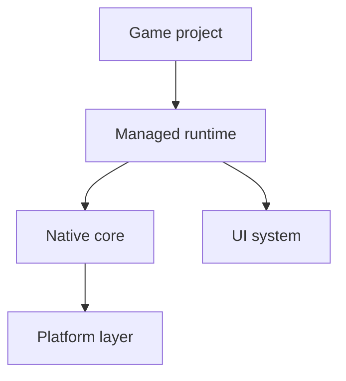
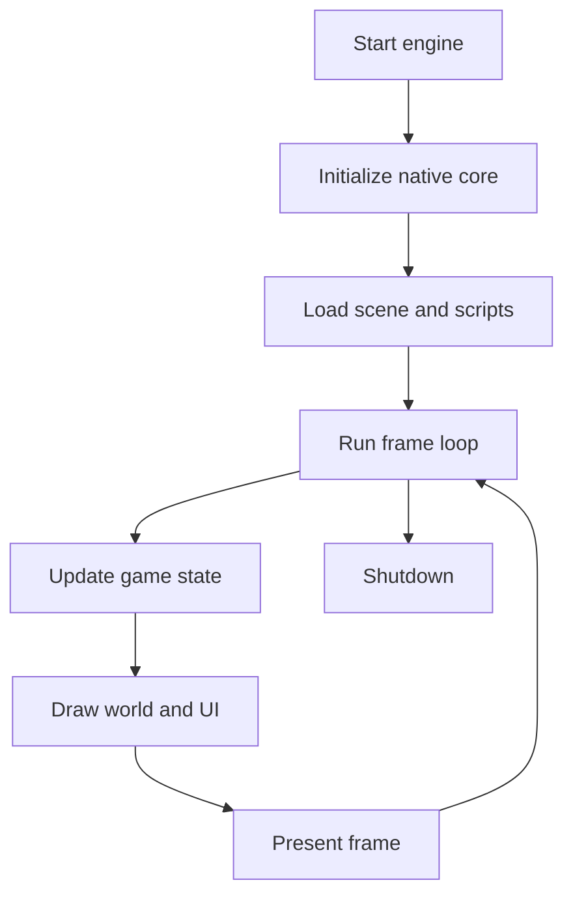

# Architecture

AssemblyEngine is split into three layers: a native core, a managed runtime, and one or more game projects built on top of the runtime.

## Layered Overview

## Native Core

The native core is built into `assemblycore.dll`. It owns the window, the software framebuffer, input state, timing, audio buffers, and the arena allocator.

### Native Modules

| File | Responsibility |
| --- | --- |
| `platform_win64.asm` | Window creation, message pump, framebuffer present, engine lifetime |
| `src/nativearm64/Platform/Windows/*` | ARM64-native window, backbuffer, and display management on Windows |
| `renderer.asm` | Clear, pixel, line, rectangle, and circle drawing |
| `sprite.asm` | BMP sprite loading and drawing |
| `input.asm` | Keyboard and mouse queries |
| `audio.asm` | WAV loading and playback |
| `timer.asm` | `QueryPerformanceCounter` timing and FPS |
| `memory.asm` | Arena allocation and reset |
| `math.asm` | Utility math exports |
| `src/nativearm64/*` | Native ARM64 backend that preserves the same export surface with a NativeAOT implementation |

The x64 assembly side uses a shared `g_engine` state structure so the platform, renderer, input, timing, and memory modules can cooperate without an extra abstraction layer. The ARM64 backend keeps the same exported API but implements it in a NativeAOT shared library so the managed runtime can stay architecture-neutral.

## Managed Runtime

The managed runtime lives in `src/runtime` and acts as the developer-facing API.

### Runtime Areas

| Folder | Responsibility |
| --- | --- |
| `Interop` | P/Invoke bindings into `assemblycore.dll` |
| `Platform` | Runtime platform boundary for OS-specific input translation, native library resolution, and native-core diagnostics |
| `Core` | High-level drawing, input, audio, time, and primitive types |
| `Engine` | `GameEngine`, scenes, entities, and components |
| `Scripting` | `GameScript` base class and script registration/loading |
| `UI` | HTML parsing, CSS parsing, layout, and rendering |

The runtime deliberately keeps game code away from raw P/Invoke. The usual extension path is: native export -> interop binding -> platform translation when needed -> managed wrapper -> gameplay usage. The platform layer now also owns native library resolution so platform-specific library layout does not leak into gameplay-facing code.

## Frame Lifecycle

The main frame loop is implemented in `GameEngine.Run()` and depends on `ae_poll_events()` to update input and timing before each frame.

## UI Pipeline

The UI system is intentionally lightweight. It parses a subset of HTML and CSS, computes a layout tree, and renders with the same graphics primitives used by gameplay code.

Current UI constraints:

- No JavaScript execution
- A focused subset of HTML tags and CSS properties
- Text rendered through a built-in bitmap font
- Best suited for HUDs, overlays, menus, and debugging panels

## Game Composition Model

Game projects interact with the engine through a small set of types:

- `GameEngine` owns startup, shutdown, scenes, scripts, and UI
- `Scene` owns entities and their lifecycle
- `Entity` owns transforms and components
- `Component` provides attach, update, draw, and detach hooks
- `GameScript` provides high-level game behavior outside the entity/component layer

This split allows scene content and game rules to stay in C# even though the window, renderer, input, timing, and memory systems remain native.

## Current Architectural Boundaries

- Rendering is software-based, not GPU-accelerated.
- Sprite loading is currently BMP-oriented.
- Audio playback is currently WAV-oriented.
- The engine currently ships two Windows-native backends: x64 NASM and ARM64 NativeAOT.
- The runtime loads whichever `assemblycore.dll` matches the current process architecture.
- The runtime wraps the most important native exports first and can grow as new capabilities are needed.

For extension guidance, continue with [implementation-guide.md](implementation-guide.md).