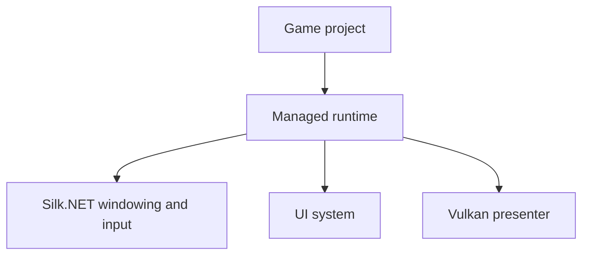
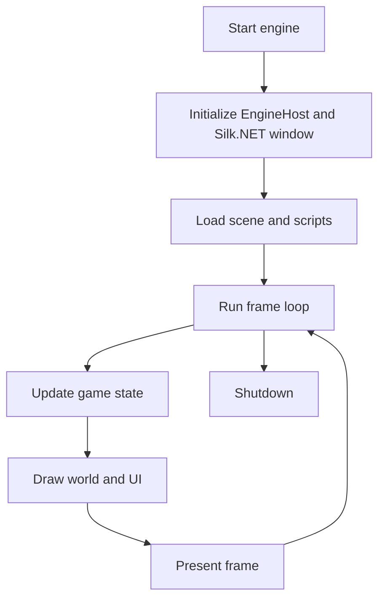

# Architecture

AssemblyEngine is a fully managed C# engine built on .NET 10 with Silk.NET for cross-platform windowing and input.

## Layered Overview

## Platform Host

The `EngineHost` static class in `src/runtime/Platform/EngineHost.cs` manages the Silk.NET window, input context, and frame timing. It replaces the former native core and provides:

- Window creation and lifecycle via `Silk.NET.Windowing`
- Keyboard and mouse input via `Silk.NET.Input`
- Frame timing via `System.Diagnostics.Stopwatch`
- Window mode management (windowed, fullscreen, borderless)
- Input injection for MCP diagnostics

## Managed Runtime

The managed runtime lives in `src/runtime` and acts as the developer-facing API.

### Runtime Areas

| Folder | Responsibility |
| --- | --- |
| `Platform` | `EngineHost` — Silk.NET window, input, and timing management |
| `Core` | High-level drawing, input, audio, time, and primitive types |
| `Engine` | `GameEngine`, scenes, entities, and components |
| `Scripting` | `GameScript` base class and script registration/loading |
| `Rendering` | Unified 2D/3D renderer, Vulkan presenter, software GDI presenter |
| `UI` | HTML parsing, CSS parsing, layout, and rendering |

The runtime keeps game code away from platform details. The usual extension path is: add the managed implementation in the right runtime area, expose it through a high-level API, then use it from gameplay code.

## Frame Lifecycle

The main frame loop is implemented in `GameEngine.Run()` and depends on `EngineHost.PollEvents()` to update input and timing before each frame.

## UI Pipeline

The UI system is intentionally lightweight. It parses a subset of HTML and CSS, computes a layout tree, and renders with the same graphics primitives used by gameplay code.

Current UI constraints:

- No JavaScript execution
- A focused subset of HTML tags and CSS properties
- Text rendered through a built-in bitmap font
- Best suited for HUDs, overlays, menus, and debugging panels

## Game Composition Model

Game projects interact with the engine through a small set of types:

- `GameEngine` owns startup, shutdown, scenes, scripts, and UI
- `Scene` owns entities and their lifecycle
- `Entity` owns transforms and components
- `Component` provides attach, update, draw, and detach hooks
- `GameScript` provides high-level game behavior outside the entity/component layer

This split allows scene content and game rules to stay in C# alongside the engine's window management, rendering, input, timing, and audio systems.

## Current Architectural Boundaries

- Rendering is software-based, not GPU-accelerated (Vulkan is used only for presentation).
- Sprite loading is currently BMP-oriented.
- Audio playback is currently WAV-oriented via managed `winmm` P/Invoke.
- The engine uses Silk.NET for cross-platform windowing and input (currently Windows x64 and ARM64).
- The runtime manages all subsystems directly in managed C# code.

For extension guidance, continue with [implementation-guide.md](implementation-guide.md).