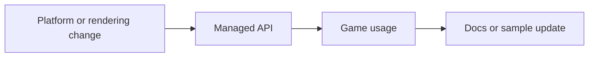

# Implementation Guide

This guide explains how AssemblyEngine is put together and how to extend it without breaking the current structure.

## Extension Philosophy

Most features should move through the engine in a straight line:



That sequence keeps the engine understandable. Avoid adding a platform feature without a managed entry point, and avoid adding a managed API that cannot actually be backed by the platform layer.

## How the Current Engine Is Wired

### Platform host responsibilities (EngineHost)

- Create and manage the window via Silk.NET
- Process input state via Silk.NET Input
- Track delta time and FPS via managed Stopwatch
- Manage window modes (windowed, fullscreen, borderless)
- Support input injection for MCP diagnostics

### Managed runtime responsibilities

- Provide developer-friendly APIs over the platform host
- Own the unified managed color/depth render surface used by both 2D and 3D draw calls
- Present that surface through Vulkan when available, or upload it via GDI software presentation when Vulkan is unavailable
- Coordinate scenes and scripts
- Define entities and components
- Parse HTML and CSS for UI overlays
- Host direct peer-to-peer or localhost multiplayer sessions through `GameEngine.Multiplayer`
- Render UI with the same graphics surface used by gameplay code

## Unified Rendering Pipeline

The renderer is now intentionally centralized in the managed runtime.

- `Graphics` routes 2D primitives, sprites, meshes, and cubes into one managed render surface.
- The render surface keeps both a color buffer and a depth buffer so 3D geometry can share the same final frame as 2D gameplay and UI.
- When requested, the runtime tries to present that surface through a Vulkan swapchain.
- If Vulkan cannot be initialized, the runtime emits a warning and presents the same framebuffer through the software GDI path instead.

That keeps 2D and 3D unified at the frame level instead of creating separate renderers with different presentation behavior.

## Adding a New Engine Feature

When adding a feature to the engine, place it in the appropriate runtime area:

1. **Platform/rendering**: Add to `src/runtime/Platform/EngineHost.cs` or the rendering subsystem
2. **High-level API**: Add a wrapper in the matching `Core/` or `Rendering/` area
3. **Demonstrate**: Show usage in a sample or document it

Example — adding a managed math helper:

```csharp
namespace AssemblyEngine.Core;

public static class EngineMath
{
    public static int Double(int value) => value + value;
}
```

If contributors cannot see how a new capability is supposed to be used, the feature is still incomplete.

## Adding a New Component

Components are the right place for reusable per-entity behavior.

```csharp
using AssemblyEngine.Core;
using AssemblyEngine.Engine;

namespace SampleGame;

public sealed class PulseComponent : Component
{
    private float _elapsed;

    public int Size { get; set; } = 24;
    public Color Color { get; set; } = new Color(120, 220, 255);

    public override void Update(float deltaTime)
    {
        _elapsed += deltaTime;
    }

    public override void Draw()
    {
        var pulse = 1f + (0.2f * MathF.Sin(_elapsed * 4f));
        var drawSize = (int)(Size * pulse);

        Graphics.DrawFilledRect(
            (int)Entity.Position.X,
            (int)Entity.Position.Y,
            drawSize,
            drawSize,
            Color);
    }
}
```

Attach it from a scene:

```csharp
var beacon = CreateEntity("Beacon");
beacon.Position = new Vector2(220, 160);
beacon.AddComponent<PulseComponent>();
```

## Adding a New Scene and Script

Scenes create content. Scripts coordinate game rules, UI updates, or cross-entity behavior.

```csharp
using AssemblyEngine.Core;
using AssemblyEngine.Engine;
using AssemblyEngine.Scripting;

namespace SampleGame;

public sealed class ArenaScene : Scene
{
    public ArenaScene() : base("Arena") { }

    public override void OnLoad()
    {
        var player = CreateEntity("Player");
        player.Position = new Vector2(160, 160);
    }
}

public sealed class ArenaScript : GameScript
{
    public override void OnDraw()
    {
        var player = Scene.FindByName("Player");
        if (player is null)
            return;

        Graphics.DrawFilledRect(
            (int)player.Position.X,
            (int)player.Position.Y,
            32,
            32,
            new Color(255, 214, 102));
    }
}
```

Register both from your game entry point:

```csharp
engine.Scenes.Register("arena", new ArenaScene());
engine.Scripts.RegisterScript(new ArenaScript());
engine.Scenes.LoadScene("arena");
```

## Adding 3D Content

Use the same `Graphics` surface and scene/script model for 3D work. The minimal camera + cube path looks like this:

```csharp
using AssemblyEngine.Core;
using AssemblyEngine.Rendering;
using AssemblyEngine.Scripting;
using Matrix4x4 = System.Numerics.Matrix4x4;
using Vector3 = System.Numerics.Vector3;

public sealed class CubeScript : GameScript
{
    private float _elapsed;

    public override void OnUpdate(float deltaTime)
    {
        _elapsed += deltaTime;
    }

    public override void OnDraw()
    {
        Graphics.SetCamera(new Camera3D
        {
            Position = new Vector3(0f, 0f, 4f),
            Target = Vector3.Zero
        });

        var transform =
            Matrix4x4.CreateScale(1.2f) *
            Matrix4x4.CreateFromYawPitchRoll(_elapsed, _elapsed * 0.6f, 0f);

        Graphics.DrawCube(transform, new Color(72, 156, 255, 190));
        Graphics.ResetCamera();
    }
}
```

If you add a new 3D primitive or camera helper, keep it on the same `Graphics` surface instead of introducing a separate 3D-specific frame loop.

## Adding Multiplayer Features

The managed runtime now exposes a direct session layer at `GameEngine.Multiplayer`.

- `HostAsync` opens a direct host on either a peer-facing socket or loopback-only localhost.
- `JoinAsync` connects a client directly to the host with no relay service in between.
- `SetReadyAsync`, `StartGameAsync`, `SendToHostAsync`, and `BroadcastAsync` move typed JSON payloads between peers.
- `Pump()` is called from the engine loop so multiplayer events are dispatched on the same frame-driven path as scripts and UI updates.

That means lobby flow and game-specific replication stay in managed scripts. The engine owns connection lifecycle, peer state, and message framing; the sample owns what a gameplay message means.

## Adding a UI Overlay

The current UI system is best used for HUDs, counters, menus, and centered overlays.

### HTML

```html
<div id="score">Score 0</div>
```

### CSS

```css
#score {
    position: absolute;
    left: 16px;
    top: 12px;
    color: #FFD86C;
    font-size: 14;
}
```

### C# update hook

```csharp
public override void OnDraw()
{
    Engine.UI?.UpdateText("score", $"Score {CurrentScore}");
}
```

If you add a new UI capability, document the supported HTML or CSS behavior because the engine intentionally supports only a focused subset.

## Where New Features Usually Belong

| Feature type | Best home |
| --- | --- |
| New draw primitive or 3D helper | `src/runtime/Rendering` + `src/runtime/Core/Graphics.cs` |
| New input query | `src/runtime/Platform/EngineHost.cs` + `src/runtime/Core/InputSystem.cs` |
| New audio capability | `src/runtime/Core/Audio.cs` |
| New scene behavior | `src/runtime/Engine` or a game project |
| New high-level gameplay rule | a `GameScript` in the game project |
| New HUD or menu behavior | `src/runtime/UI` plus HTML/CSS assets |

## Contribution Checklist for Feature Work

- Add the managed implementation in the correct runtime area
- Add a high-level API wrapper if appropriate
- Update docs and at least one usage example
- Build the sample game on Windows

The fastest way to produce maintainable changes is to respect the existing layer boundaries instead of skipping around them.