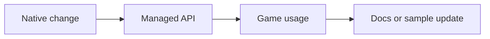

# Implementation Guide

This guide explains how AssemblyEngine is put together and how to extend it without breaking the current structure.

## Extension Philosophy

Most features should move through the engine in a straight line:



That sequence keeps the engine understandable. Avoid adding a native feature without a managed entry point, and avoid adding a managed API that cannot actually be backed by the native layer.

## How the Current Engine Is Wired

### Native core responsibilities

- Create and own the Win32 window
- Maintain the framebuffer
- Process input state
- Track delta time and FPS
- Manage native memory with a simple arena allocator
- Load and draw sprites
- Load and play audio

### Managed runtime responsibilities

- Provide developer-friendly APIs over the native exports
- Coordinate scenes and scripts
- Define entities and components
- Parse HTML and CSS for UI overlays
- Render UI with the same graphics surface used by gameplay code

## Adding a New Native Feature

When a feature belongs in the native core, follow the same pipeline every time.

### 1. Add the implementation in the right assembly module

Choose the native file that matches the subsystem. For a math helper, that is usually `src/core/math.asm`. For a drawing primitive, use `src/core/renderer.asm`.

Example pattern:

```asm
global ae_math_double

section .text
ae_math_double:
    lea eax, [ecx + ecx]
    ret
```

### 2. Export the symbol

Add the new function name to `src/core/exports.def`:

```text
    ae_math_double
```

### 3. Bind it in the managed interop layer

Add the P/Invoke declaration to `src/runtime/Interop/NativeCore.cs`:

```csharp
[LibraryImport(DllName, EntryPoint = "ae_math_double")]
internal static partial int MathDouble(int value);
```

### 4. Expose it through the right managed API surface

If the feature is part of math, graphics, audio, or input, add a wrapper in the matching runtime area instead of calling `NativeCore` directly from game code.

```csharp
public static class EngineMath
{
    public static int Double(int value) => NativeCore.MathDouble(value);
}
```

### 5. Demonstrate it in a sample or document it

If contributors cannot see how a new capability is supposed to be used, the feature is still incomplete.

## Adding a New Component

Components are the right place for reusable per-entity behavior.

```csharp
using AssemblyEngine.Core;
using AssemblyEngine.Engine;

namespace SampleGame;

public sealed class PulseComponent : Component
{
    private float _elapsed;

    public int Size { get; set; } = 24;
    public Color Color { get; set; } = new Color(120, 220, 255);

    public override void Update(float deltaTime)
    {
        _elapsed += deltaTime;
    }

    public override void Draw()
    {
        var pulse = 1f + (0.2f * MathF.Sin(_elapsed * 4f));
        var drawSize = (int)(Size * pulse);

        Graphics.DrawFilledRect(
            (int)Entity.Position.X,
            (int)Entity.Position.Y,
            drawSize,
            drawSize,
            Color);
    }
}
```

Attach it from a scene:

```csharp
var beacon = CreateEntity("Beacon");
beacon.Position = new Vector2(220, 160);
beacon.AddComponent<PulseComponent>();
```

## Adding a New Scene and Script

Scenes create content. Scripts coordinate game rules, UI updates, or cross-entity behavior.

```csharp
using AssemblyEngine.Core;
using AssemblyEngine.Engine;
using AssemblyEngine.Scripting;

namespace SampleGame;

public sealed class ArenaScene : Scene
{
    public ArenaScene() : base("Arena") { }

    public override void OnLoad()
    {
        var player = CreateEntity("Player");
        player.Position = new Vector2(160, 160);
    }
}

public sealed class ArenaScript : GameScript
{
    public override void OnDraw()
    {
        var player = Scene.FindByName("Player");
        if (player is null)
            return;

        Graphics.DrawFilledRect(
            (int)player.Position.X,
            (int)player.Position.Y,
            32,
            32,
            new Color(255, 214, 102));
    }
}
```

Register both from your game entry point:

```csharp
engine.Scenes.Register("arena", new ArenaScene());
engine.Scripts.RegisterScript(new ArenaScript());
engine.Scenes.LoadScene("arena");
```

## Adding a UI Overlay

The current UI system is best used for HUDs, counters, menus, and centered overlays.

### HTML

```html
<div id="score">Score 0</div>
```

### CSS

```css
#score {
    position: absolute;
    left: 16px;
    top: 12px;
    color: #FFD86C;
    font-size: 14;
}
```

### C# update hook

```csharp
public override void OnDraw()
{
    Engine.UI?.UpdateText("score", $"Score {CurrentScore}");
}
```

If you add a new UI capability, document the supported HTML or CSS behavior because the engine intentionally supports only a focused subset.

## Where New Features Usually Belong

| Feature type | Best home |
| --- | --- |
| New draw primitive | `src/core/renderer.asm` + `src/runtime/Core/Graphics.cs` |
| New input query | `src/core/input.asm` + `src/runtime/Core/InputSystem.cs` |
| New audio capability | `src/core/audio.asm` + `src/runtime/Core/Audio.cs` |
| New scene behavior | `src/runtime/Engine` or a game project |
| New high-level gameplay rule | a `GameScript` in the game project |
| New HUD or menu behavior | `src/runtime/UI` plus HTML/CSS assets |

## Contribution Checklist for Feature Work

- Add or update the native implementation if the feature belongs in the core
- Export the symbol when required
- Add the managed interop binding
- Add a managed wrapper or high-level API
- Update docs and at least one usage example
- Build the sample game on Windows x64

The fastest way to produce maintainable changes is to respect the existing layer boundaries instead of skipping around them.