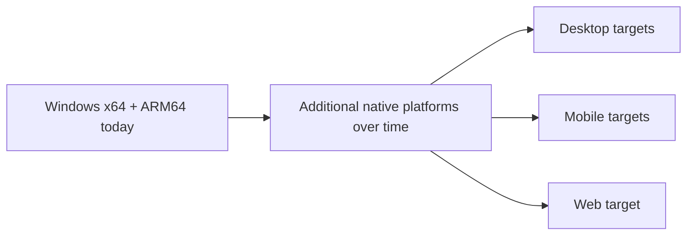

# Project Goals

AssemblyEngine is not trying to become a giant engine overnight. The current goal is to build a clean, understandable 2D engine where the low-level core is explicit and the gameplay layer remains productive.

## Primary Goals

- Build a readable 2D engine core in x86-64 assembly
- Keep gameplay scripting and scene composition simple in C#
- Support in-game UI with HTML/CSS instead of a separate browser runtime
- Maintain a codebase that is easy to inspect, document, and extend
- Grow toward multi-platform support from a stable Windows x64 foundation while keeping the Windows ARM64 backend aligned with the same managed contract

## Current Milestone

The current milestone is a solid Windows x64 vertical slice with a matching Windows ARM64 backend that preserves the same managed API surface. It includes:

- Window creation and event processing
- Software rendering primitives
- Sprite loading and drawing
- Keyboard and mouse input
- Basic WAV audio playback
- Time and FPS tracking
- Scene, entity, component, and script orchestration
- HTML/CSS HUD rendering

## Platform Direction

Windows x64 remains the delivery focus until the native/runtime contract is stable enough to justify additional native platform layers.

## Near-Term Goals

- Broaden the managed wrapper surface over the native API
- Improve the sample content so new contributors can learn the engine faster
- Expand the UI subset and documentation around it
- Tighten build, setup, and contributor documentation
- Keep architecture diagrams current as the engine evolves

## Longer-Term Goals

- Add new platform backends without rewriting the higher-level gameplay API
- Improve tooling around assets, debugging, and diagnostics
- Offer more built-in components and gameplay helpers
- Build a stronger sample catalog that demonstrates focused engine features

## Non-Goals for the Current Phase

- A 3D renderer
- A full browser engine for UI
- A large editor application before the runtime surface is stable
- Engine complexity that hides how the native core works

## Success Criteria

AssemblyEngine is succeeding when:

- A contributor can trace a feature from the sample game down into the native core
- Adding a native export to the managed runtime is straightforward
- The docs stay aligned with the actual codebase
- The sample game remains a reliable smoke test for the engine stack

To see how those goals map onto code changes, read [implementation-guide.md](implementation-guide.md).