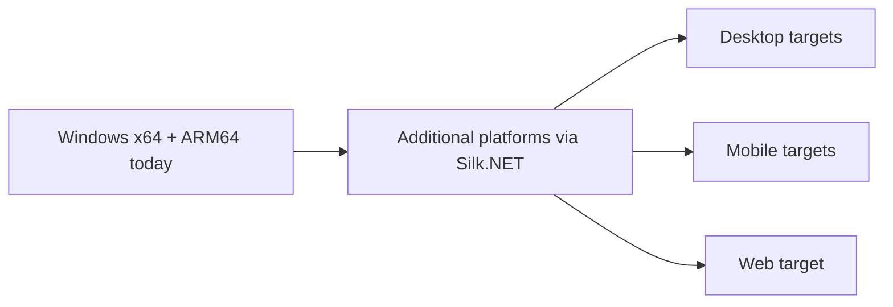

# Project Goals

AssemblyEngine is not trying to become a giant engine overnight. The current goal is to build a clean, understandable 2D engine where the low-level core is explicit and the gameplay layer remains productive.

## Primary Goals

- Build a readable, fully managed game engine in C# with Silk.NET and Vulkan
- Keep gameplay scripting and scene composition simple in C#
- Support in-game UI with HTML/CSS instead of a separate browser runtime
- Maintain a codebase that is easy to inspect, document, and extend
- Grow toward multi-platform support from a stable Windows foundation using Silk.NET's cross-platform capabilities

## Current Milestone

The current milestone is a solid Windows vertical slice with Silk.NET windowing and input. It includes:

- Window creation and event processing
- Software rendering primitives
- Sprite loading and drawing
- Keyboard and mouse input
- Basic WAV audio playback
- Time and FPS tracking
- Scene, entity, component, and script orchestration
- HTML/CSS HUD rendering

## Platform Direction

Windows remains the delivery focus until the engine is stable enough to justify additional platform layers. Silk.NET provides the cross-platform foundation.

## Near-Term Goals

- Stabilize the managed Silk.NET platform layer
- Improve the sample content so new contributors can learn the engine faster
- Expand the UI subset and documentation around it
- Tighten build, setup, and contributor documentation
- Keep architecture diagrams current as the engine evolves
- Expand Vulkan rendering capabilities

## Longer-Term Goals

- Add new platform targets leveraging Silk.NET's cross-platform support
- Improve tooling around assets, debugging, and diagnostics
- Offer more built-in components and gameplay helpers
- Build a stronger sample catalog that demonstrates focused engine features

## Non-Goals for the Current Phase

- A full GPU-accelerated 3D renderer
- A full browser engine for UI
- A large editor application before the runtime surface is stable

## Success Criteria

AssemblyEngine is succeeding when:

- A contributor can trace a feature from the sample game through the managed runtime
- Adding a new engine capability is straightforward
- The docs stay aligned with the actual codebase
- The sample game remains a reliable smoke test for the engine stack

To see how those goals map onto code changes, read [implementation-guide.md](implementation-guide.md).